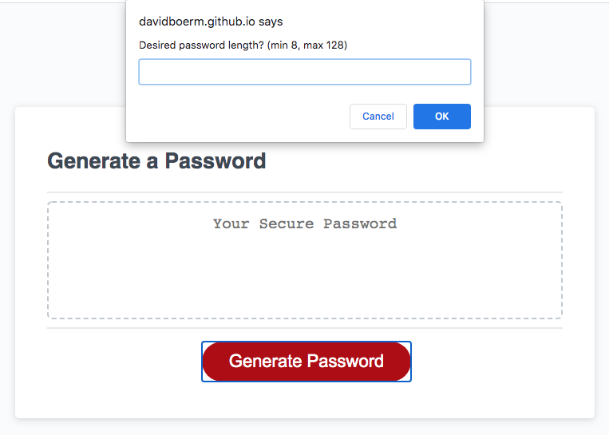
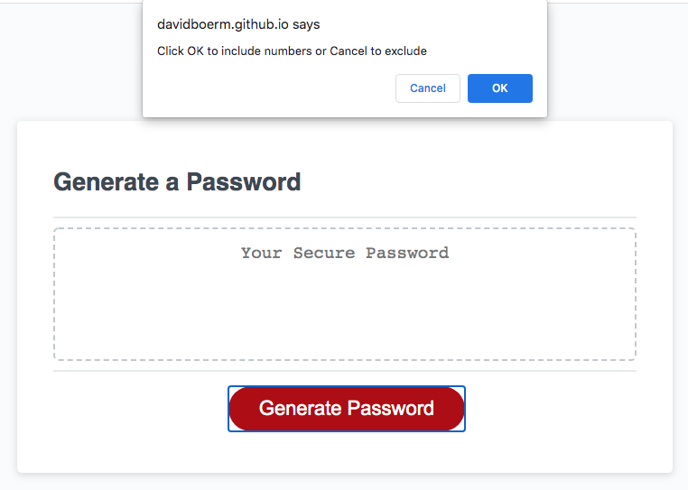
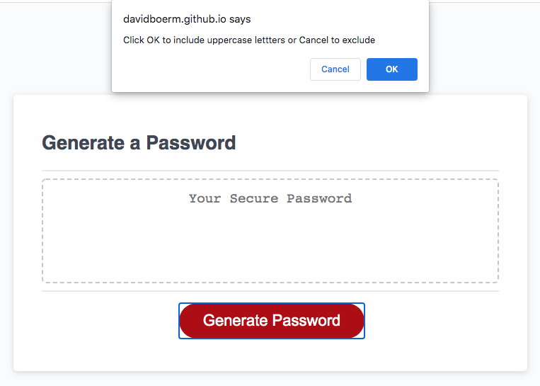
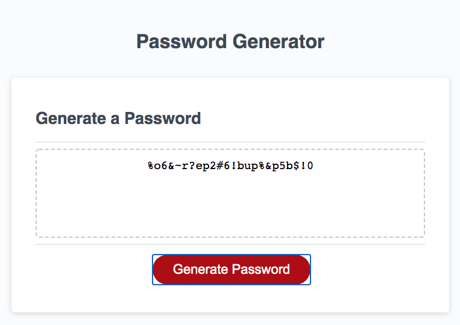

# 03-JavaScript Password Generator

## Project Description

Assignment to modify existing code to enable functioning password generator 

- Includes min/max validation for password length and that it is a number
- Includes options for uppercase, lowercase, numbers and symbol characters
- Validates that at least one character type must be selected

### Screenshot

### Link to deployed website
https://davidboerm.github.io/03-javascript-password-generator/
